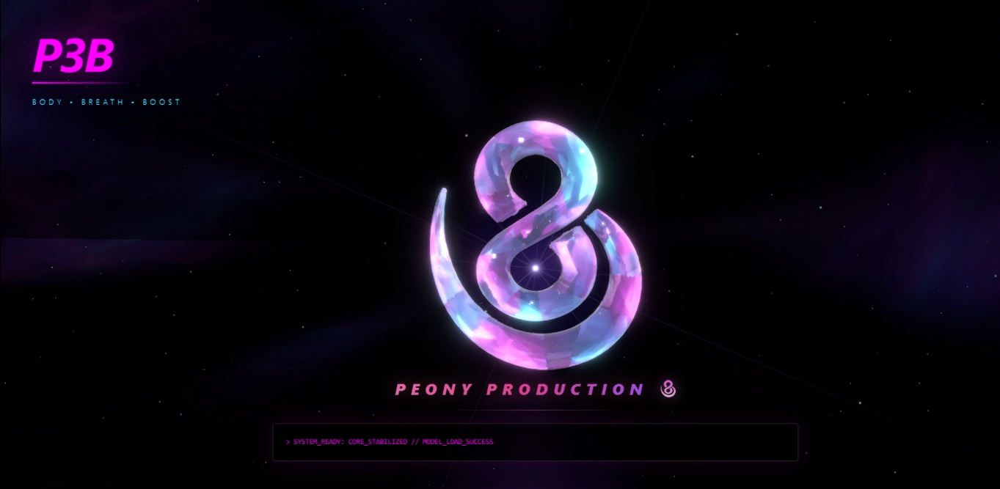

# 🌌 P3B-CORE | Unified Intelligence Hub

---

## 📝 Concept: The Genesis

P3B-CORE (Peony Production 3B) is a **high-end personal branding environment** designed to merge cinematic 3D visuals with functional AI interfaces. It serves as the digital foundation for a unified profile spanning three performance pillars:

* **Body (Calisthenics):** Discipline, physical mastery, and progress tracking
* **Breath (IT Projects):** High-level software architecture and digital innovation
* **Boost (Trading):** Real-time data analysis, market strategy, and risk management

The current iteration establishes a **robust graphical core**, leveraging bleeding-edge web technologies to deliver an immersive, cinematic home-page experience.

---

## 🚀 Live Demo

**Production Environment:**
👉 [https://peony-alpha.vercel.app/](https://peony-alpha.vercel.app/)

---

## 📸 Screenshot

---

## 🏗️ Technical Architecture

The application is built as a **pure frontend Next.js project** using **TypeScript**, optimized for extreme iteration speed and runtime performance.

* **Framework:** Next.js 16.1.6 (App Router)
* **Language:** TypeScript
* **Bundler:** Turbopack
* **Styling:** Tailwind CSS 4
* **State Management:** Zustand

*No backend. No database. Fully client-side graphical intelligence.*

---

## 🌌 3D Rendering Engine

The visual core is powered by a custom WebGL pipeline using **React Three Fiber**:

* **Procedural Nebula:** GLSL shader-driven cosmic environment
* **Dynamic Lighting:** Real-time light synthesis interacting with high-gloss assets
* **Particle Systems:** Shooting stars and ambient particles creating spatial depth

The scene dynamically adapts to device performance and viewport resolution.

---

## 🖥️ HUD & Interface Logic

The UI is designed as a **Cyberpunk OS overlay** layered above the 3D scene:

* **Agent Terminal:**

  * Command interface prepared for future LLM integration
  * Intended as a control layer for visual and structural mutations

* **MiniGraph Telemetry:**

  * Canvas-based real-time data visualization
  * Sine-wave + controlled noise simulation
  * Custom glow engine using `shadowBlur` for terminal aesthetics

---

## ✨ Key Features

* Ultra-fast HMR via **Turbopack**
* Utility-first styling with **Tailwind CSS 4**
* Deterministic state synchronization between UI and 3D canvas via **Zustand**
* Responsive 3D camera logic and adaptive particle density

---

## 📂 Project Structure

p3b-core/
├─ src/
│  ├─ app/                 # Next.js App Router
│  ├─ components/
│  │  ├─ canvas/           # 3D Scene & WebGL orchestration
│  │  │  ├─ Scene.tsx      # R3F render loop
│  │  │  ├─ Nebula.tsx     # GLSL shader background
│  │  │  └─ LogoModel.tsx  # Interactive 3D identity asset
│  │  └─ ui/               # Cyberpunk HUD components
│  │     ├─ AgentTerminal  # AI interaction layer
│  │     └─ MiniGraph      # Canvas-based telemetry
│  └─ store/
│     └─ useStore.ts       # Central state intelligence

---

## 🔮 Roadmap: Future Expansion

* **Spatial Navigation:** Seamless camera transitions between Body / Breath / Boost
* **Visual Rebuild AI:** Natural-language driven mutation of global parameters
* **Live Telemetry:** Integration of real-world APIs (Trading, Fitness, Performance)

---

## ⚙️ Local Development

Clone the repository:

git clone [https://github.com/janpivonka/p3b-core.git](https://github.com/janpivonka/p3b-core.git)
cd p3b-core
npm install

Run the development server:

npm run dev

---

## 👤 Author

**Jan Pivoňka (Peony)**
Architect of Body & Code

GitHub: [https://github.com/janpivonka](https://github.com/janpivonka)
Portfolio: [https://peony-alpha.vercel.app/](https://peony-alpha.vercel.app/)

---

SYSTEM_STATUS: GRAPHIC_CORE_STABILIZED // READY_FOR_UPGRADE
